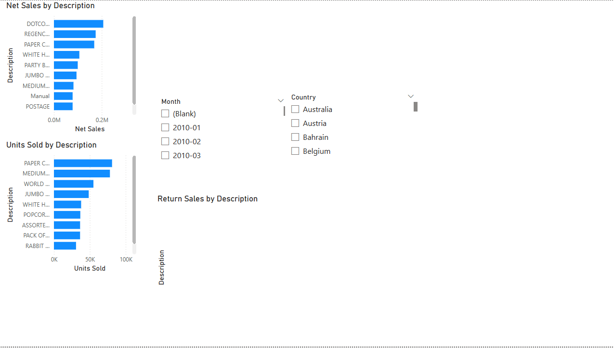

# Retail Weekly Performance Pack (Power BI)

A 3-page Power BI reporting pack built from invoice-level online retail transactions (2010–2011) to track KPI performance and highlight top products and markets.

## Dashboard Pages
### Executive Summary

### Product Performance

### Country Performance

## PDF Report
- [Download the PDF](Retail_Weekly_Pack_2010-2011.pdf)

## Dataset
Invoice-level fields:
- InvoiceNo, StockCode, Description, Quantity, InvoiceDate, UnitPrice, CustomerID, Country

Notes:
- Negative `Quantity` can indicate returns/cancellations.
- Source data contains blanks; basic cleaning was applied.

## Data Preparation (Power Query)
- Set correct data types (IDs handled as text where appropriate)
- Created `InvoiceDateDate` (date only) from `InvoiceDate`
- Created `SalesAmount = Quantity * UnitPrice`
- Filtered obvious invalid rows (e.g., non-positive unit price, missing descriptions)

## Key Measures (DAX)
- Net Sales (positive quantity only)
- Orders (distinct invoices)
- Customers (distinct customers)
- AOV (average order value)
- Return Sales and Return Rate % (based on negative quantity)

## Tools
- Power BI Desktop
- Power Query
- DAX
- Basic data modelling (date table + relationship)

## Insights (example — replace with yours)
1. Top revenue market is the United Kingdom, followed by the Netherlands.
2. A small number of products contribute a large share of total net sales.
3. Performance varies significantly across countries and months.

## Next Improvements
- Add product/category dimension table for cleaner reporting
- Add cancellation handling (e.g., invoices starting with “C”)
- Add monthly/weekly variance commentary
